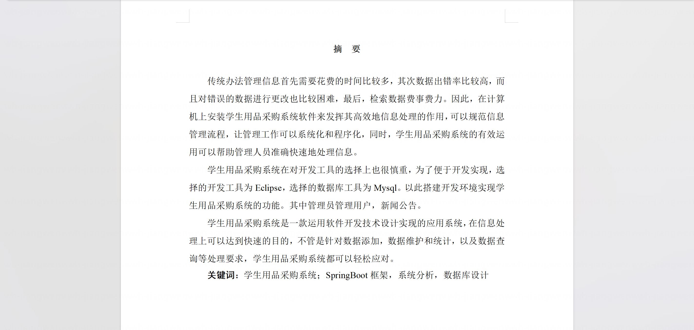
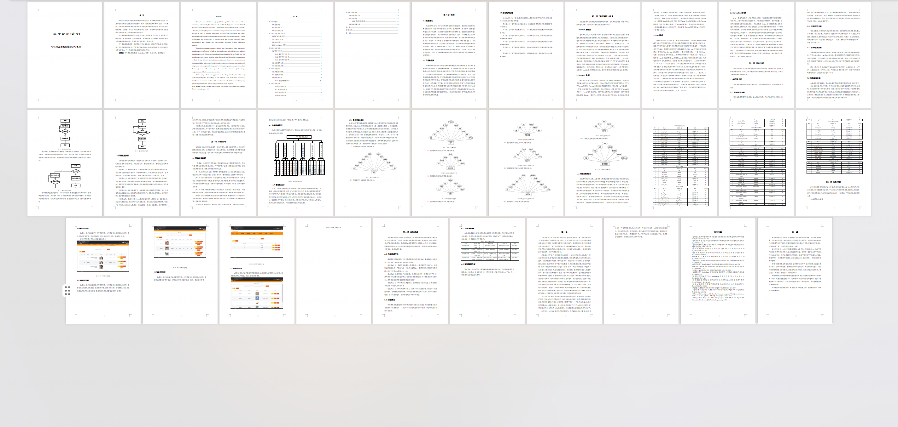
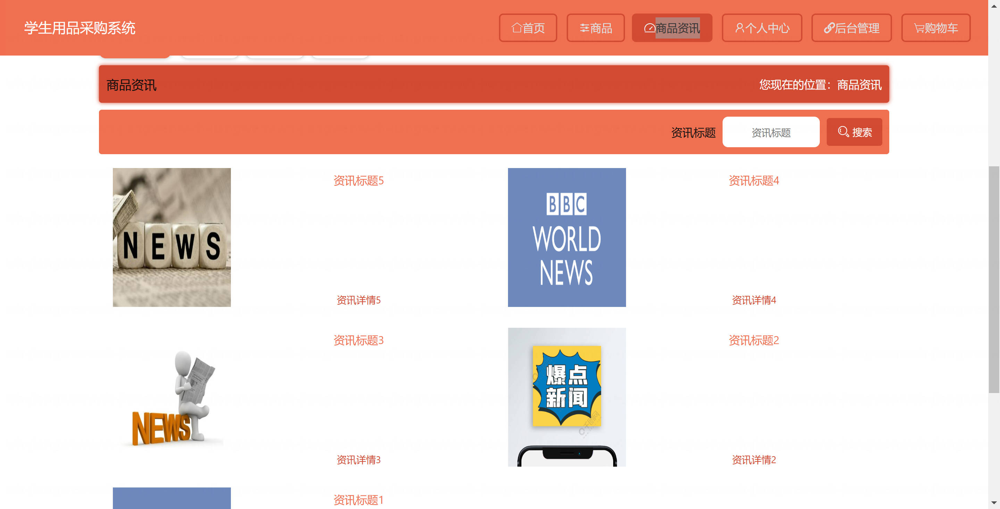
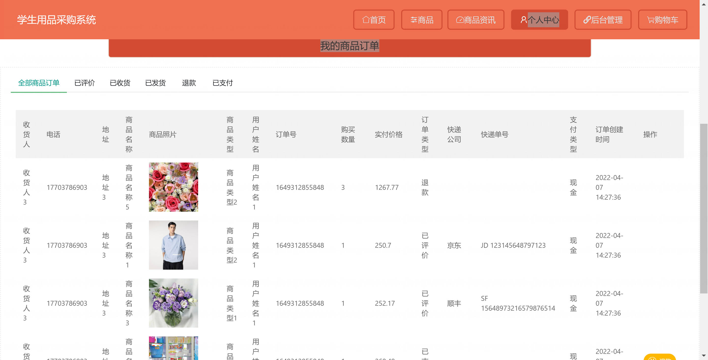
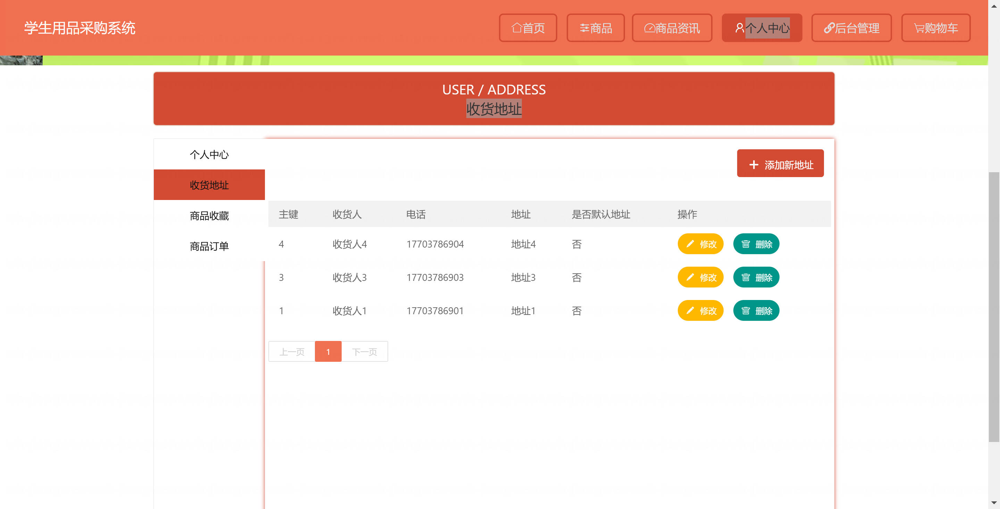
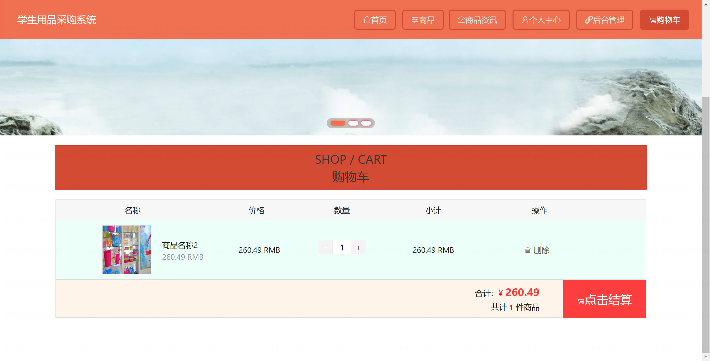
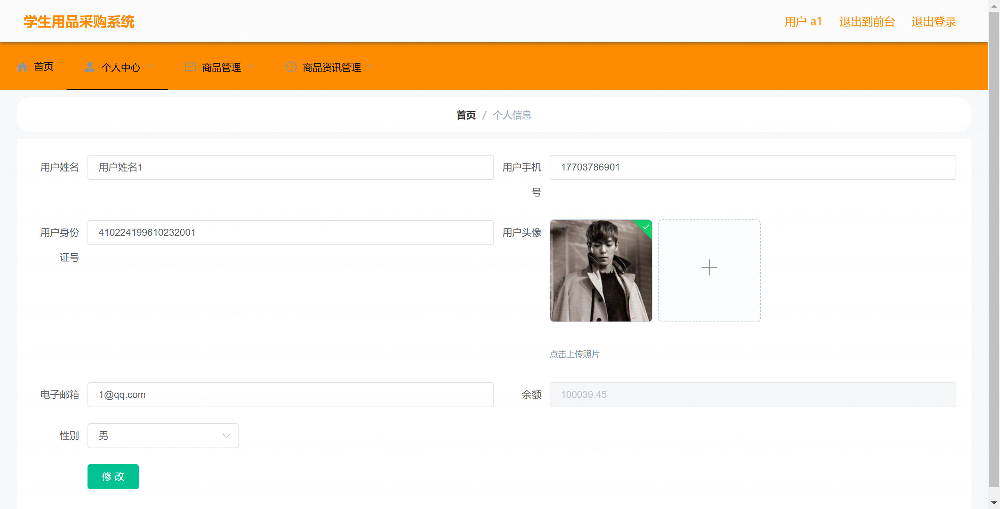

<h1 align="center">基于SpringBoot的学生用品采购系统【带论文】</h1>

- <b>完整代码获取地址：从戎源码网 ([https://armycodes.com/](https://armycodes.com/))</b>
- <b>技术探讨、资料分享，请加QQ群：692619798</b>
- <b>作者微信：19941326836  QQ：3645296857</b>
- <b>承接计算机毕业设计、Java毕业设计、Python毕业设计、深度学习、机器学习</b>
- <b>选题+开题报告+任务书+程序定制+安装调试+论文+答辩ppt 一条龙服务</b>
- <b>所有选题地址 ([https://github.com/Descartes007/allProject](https://github.com/Descartes007/allProject)) </b>

## 一、项目介绍

基于SpringBoot的学生用品采购系统，系统角色为管理员和用户，主要功能如下
### 管理员：
- 基本操作：登录、修改密码、获取与修改个人信息
- 商品管理：商品列表/分页、查看商品详情、新增商品、编辑商品、删除商品、上下架、图片上传
- 订单管理：订单列表/分页、查看订单详情、发货、确认收货、退款处理、订单状态管理、查看/管理订单评价
- 用户管理：用户列表/分页、查看用户详情、新增/编辑/删除用户、重置密码、获取 session 用户信息
- 资讯管理：资讯（新闻）列表/新增/编辑/删除、前端资讯发布与管理
- 评价与收藏管理：管理商品评价、管理商品收藏记录
- 地址管理：收货地址增删改查、设置默认地址
- 购物车管理：查看/管理购物车项、批量下单支持
### 用户：
- 基本操作：注册、登录、退出、重置密码、获取个人 session 信息
- 浏览与购物：商品列表/搜索、商品详情查看、商品收藏、商品评价
- 购物车与下单：加入购物车、购物车列表管理、提交订单、余额/积分支付、查看订单状态、申请退款、确认收货、评价订单
- 地址管理：新增/编辑/删除收货地址、设置默认地址
- 资讯查看：查看资讯列表与详情

## 二、项目技术

- 编程语言：Java
- 项目架构：B/S 架构
- 前端技术：Vue 2、Vue Router、Vuex、Element UI、Axios（封装请求、带 Token）
- 后端技术：Spring Boot、MyBatis-Plus / MyBatis、MySQL、FastJson（JSON 处理）、Hutool 等工具库

## 三、运行环境

- JDK版本：1.8及以上都可以
- 操作系统：Windows7/10、MacOS
- 开发工具：IDEA、Ecplise、MyEclipse都可以

## 四、数据库配置文件

- npm版本：6.14.13及以上都可以
- Redis版本：3.2.100及以上都可以
- 文件名：application.yml
- 编码类型：utf8

## 论文截图

## 系统截图

